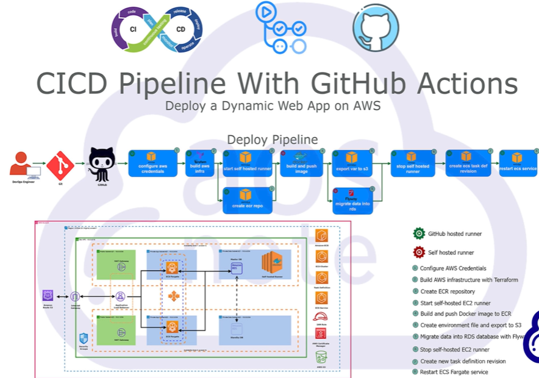
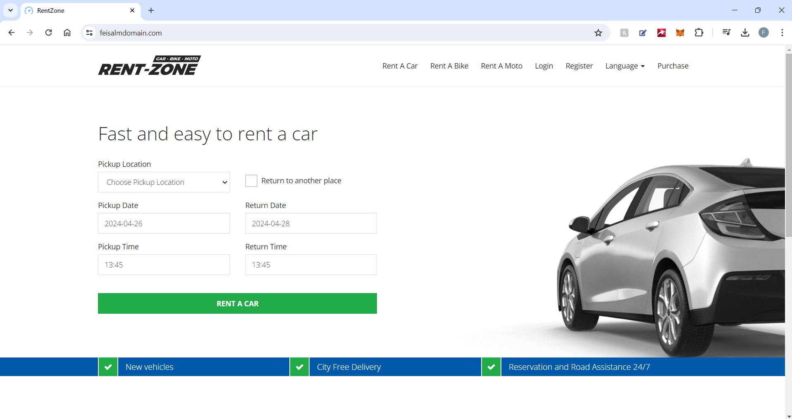

# CI/CD Pipeline with Terraform, AWS, and GitHub Actions

This repository contains the infrastructure as code and CI/CD pipeline setup for deploying an application on AWS using Terraform and GitHub Actions.

## Architecture Diagram

*(Insert architecture diagram here)*



## Website Screenshot

*(Insert screenshot of the deployed website here)*



## Prerequisites

Before getting started, ensure you have the following installed and set up:

1. Terraform
2. GitHub account
3. Git
4. AWS CLI
5. Visual Studio Code with Terraform extensions

## Deployment Steps

Follow these steps to set up the CI/CD pipeline:

1. Generate AWS key pairs for secure connections.
2. Add the public SSH key to your GitHub account.
3. Create an IAM user in AWS and generate an access key.
4. Create an S3 bucket to store Terraform state.
5. Create a DynamoDB table to lock the Terraform state.
6. Create secrets in AWS Secrets Manager to store sensitive information.
7. Register a domain in Route 53.
8. Upload Terraform code and test its functionality.
9. Create a GitHub Personal Access Token and upload secrets to ECR.
10. Create a GitHub Actions workflow file.
11. Configure GitHub Actions jobs for AWS infrastructure deployment.

### Deployment Codes

**Example GitHub Actions Workflow:**

```yaml
name: CI/CD Pipeline

on:
  push:
    branches:
      - main

jobs:
  deploy:
    runs-on: ubuntu-latest

    steps:
      - name: Checkout Repository
        uses: actions/checkout@v2

      - name: Configure AWS Credentials
        uses: aws-actions/configure-aws-credentials@v1
        with:
          aws-access-key-id: ${{ secrets.AWS_ACCESS_KEY_ID }}
          aws-secret-access-key: ${{ secrets.AWS_SECRET_ACCESS_KEY }}
          aws-region: us-east-1

      - name: Terraform Init
        run: terraform init

      - name: Terraform Plan
        run: terraform plan -out=tfplan

      - name: Terraform Apply
        if: github.event_name == 'push' && contains(github.event.head_commit.message, '[terraform apply]')
        run: terraform apply -auto-approve tfplan
```

## Usage

To use this repository:

1. Clone the repository.
2. Modify the Terraform code to suit your requirements.
3. Set up secrets and environment variables as needed.
4. Push changes to trigger the CI/CD pipeline.

---

Feel free to customize this README further with specific details or additional instructions as needed.
